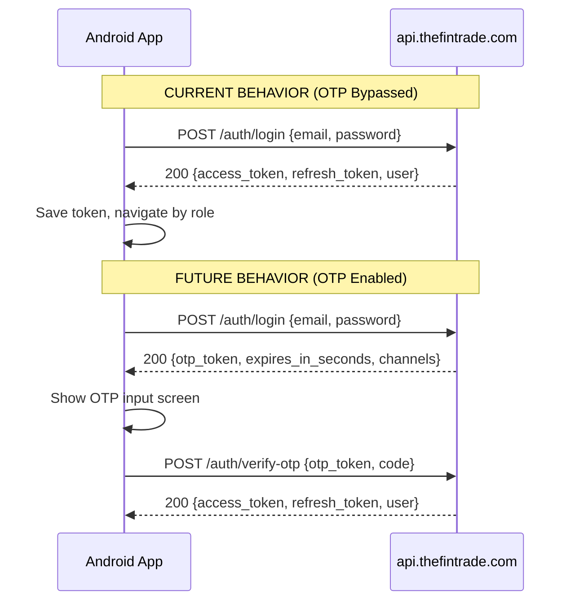
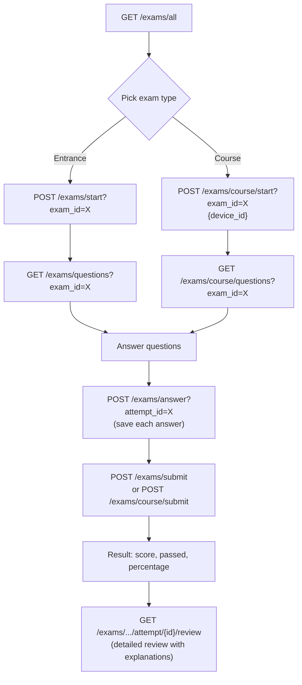
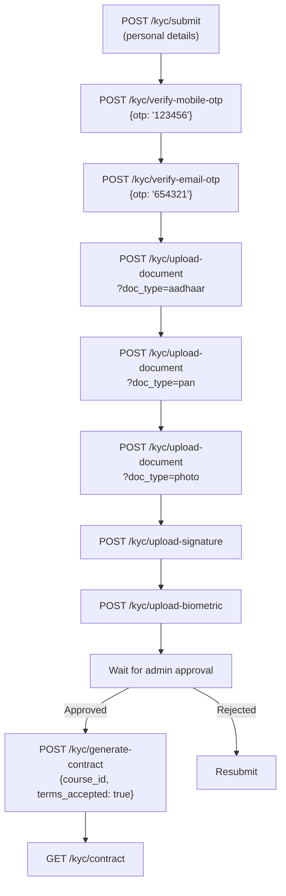
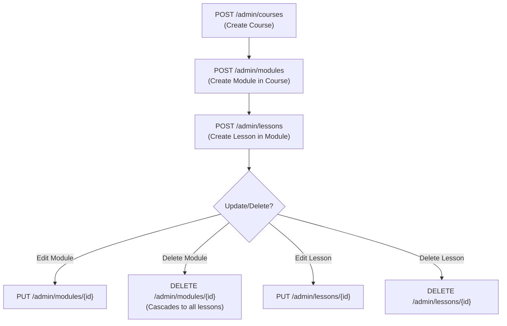

# FinTrade LMS — API Reference for Android

> **Base URL:** `https://api.thefintrade.com`
> **Auth Header:** `Authorization: Bearer <access_token>`
> **Content-Type:** `application/json` (unless file upload)

---

## Roles in the System

| Role | How it's created | Navigates to |
|------|-----------------|--------------|
| `student` | Self-registration via `/auth/register` | Student Dashboard |
| `faculty` | Created by admin via `/admin/users/create-faculty` | Teacher Dashboard |
| `distributor` | Created by admin via `/admin/users/create-distributor` | Distributor Dashboard |
| `admin` | Created by admin via `/admin/users/create-admin` | Admin Dashboard |
| `super_admin` | Seeded in DB | Admin Dashboard |

After login, check `user.roles[].name` to decide which dashboard to navigate to:

```kotlin
val roles = user.roles.map { it.name }
when {
    "super_admin" in roles || "admin" in roles -> navigateTo(AdminDashboard)
    "faculty" in roles -> navigateTo(TeacherDashboard)
    "distributor" in roles -> navigateTo(DistributorDashboard)
    else -> navigateTo(StudentDashboard)
}
```

---

## 1. Authentication (`/auth`)

### How Login Works Right Now (OTP Bypass)

> [!IMPORTANT]
> **OTP is currently BYPASSED for ALL users.** The backend skips the OTP step entirely and returns tokens directly on successful login. This is temporary while AWS SES verification is pending.



**How to handle both cases in Android code:**

The response type tells you which flow you're in:
- If the response has `access_token` → OTP was bypassed, you have your tokens, go to dashboard
- If the response has `otp_token` → OTP is required, show the OTP screen

```kotlin
val response = api.login(email, password)

if (response.access_token != null) {
    // OTP BYPASSED — tokens returned directly
    saveToken(response.access_token)
    saveUser(response.user)
    navigateByRole(response.user.roles)
} else if (response.otp_token != null) {
    // OTP REQUIRED — show OTP input screen
    showOtpScreen(
        otpToken = response.otp_token,
        expiresIn = response.expires_in_seconds,  // countdown timer (usually 300s)
        channels = response.channels               // ["email"] or ["email", "sms"]
    )
}
```

---

### `POST /auth/register`
> **Auth:** None

Creates a new **student** account. Returns tokens immediately (no OTP).

```json
// REQUEST
{
  "email": "user@example.com",
  "full_name": "John Doe",
  "phone": "+919876543210",    // optional, max 20 chars
  "password": "securepass123"  // min 8 chars, max 128 chars
}

// RESPONSE 201
{
  "access_token": "eyJhbGciOiJIUzI1NiIs...",
  "refresh_token": "eyJhbGciOiJIUzI1NiIs...",
  "token_type": "bearer",
  "user": {
    "id": 5,
    "email": "user@example.com",
    "full_name": "John Doe",
    "phone": "+919876543210",
    "is_active": true,
    "is_verified": false,
    "avatar_url": null,
    "roles": [{"id": 4, "name": "student"}],
    "created_at": "2026-05-20T10:00:00Z"
  }
}

// ERROR 409
{"detail": "Email already registered"}
```

---

### `POST /auth/login`
> **Auth:** None

```json
// REQUEST
{
  "email": "user@example.com",
  "password": "securepass123"
}

// RESPONSE 200 — Current (OTP bypassed): ALWAYS returns this
{
  "access_token": "eyJhbGciOiJIUzI1NiIs...",
  "refresh_token": "eyJhbGciOiJIUzI1NiIs...",
  "token_type": "bearer",
  "user": {
    "id": 5,
    "email": "user@example.com",
    "full_name": "John Doe",
    "phone": "+919876543210",
    "is_active": true,
    "is_verified": false,
    "avatar_url": null,
    "roles": [{"id": 4, "name": "student"}],
    "created_at": "2026-05-20T10:00:00Z"
  }
}

// RESPONSE 200 — Future (OTP enabled): will return this instead
{
  "message": "Verification code sent",
  "otp_token": "abc123def456...",
  "expires_in_seconds": 300,
  "channels": ["email"]
}

// ERROR 401
{"detail": "Invalid credentials"}
```

---

### `POST /auth/verify-otp`
> **Auth:** None
> **Note:** Only needed when OTP is enabled (future). Currently login returns tokens directly.

```json
// REQUEST
{
  "otp_token": "abc123def456...",
  "code": "482917"               // exactly 6 digits
}

// RESPONSE 200 — same TokenResponse as login
{
  "access_token": "...",
  "refresh_token": "...",
  "token_type": "bearer",
  "user": { ... }
}

// ERROR 400
{"detail": "Invalid or expired OTP code"}
```

---

### `POST /auth/resend-otp`
> **Auth:** None
> **Note:** Only needed when OTP is enabled (future).

```json
// REQUEST
{ "otp_token": "abc123def456..." }

// RESPONSE 200
{
  "message": "New verification code sent",
  "otp_token": "new_token_789...",
  "expires_in_seconds": 300,
  "channels": ["email"]
}
```

---

### `GET /auth/me`
> **Auth:** Bearer token required

Returns current user profile. Use this on app launch to validate stored token.

```json
// RESPONSE 200
{
  "id": 5,
  "email": "user@example.com",
  "full_name": "John Doe",
  "phone": "+919876543210",
  "is_active": true,
  "is_verified": false,
  "avatar_url": null,
  "roles": [{"id": 4, "name": "student"}],
  "created_at": "2026-05-20T10:00:00Z"
}

// ERROR 401
{"detail": "Could not validate credentials"}
```

---

### `POST /auth/logout`
> **Auth:** Bearer token required

```json
// RESPONSE 200
{"message": "Logged out successfully"}
```

---

## 2. Courses (`/courses`)

### `GET /courses`
> **Auth:** None (public)

List all published courses. Use `?is_featured=true` for homepage featured courses.

```
GET /courses?skip=0&limit=20
GET /courses?is_featured=true
```

```json
// RESPONSE 200
[
  {
    "id": 1,
    "title": "Stock Market Fundamentals",
    "slug": "stock-market-fundamentals",
    "short_description": "Learn the basics of stock trading",
    "thumbnail_url": "/uploads/thumb1.jpg",
    "price": 9999.0,
    "original_price": 14999.0,
    "difficulty_level": "beginner",
    "duration_hours": 40,
    "is_published": true,
    "is_featured": true,
    "marketing_highlights": ["Live Classes", "Certificate", "Placement"],
    "created_at": "2026-05-01T10:00:00Z"
  }
]
```

---

### `GET /courses/{course_id}`
> **Auth:** None (public)

Full course details with modules and lessons.

```json
// RESPONSE 200
{
  "id": 1,
  "title": "Stock Market Fundamentals",
  "slug": "stock-market-fundamentals",
  "description": "Full markdown description...",
  "short_description": "Learn the basics",
  "thumbnail_url": "/uploads/thumb1.jpg",
  "price": 9999.0,
  "original_price": 14999.0,
  "difficulty_level": "beginner",
  "duration_hours": 40,
  "is_published": true,
  "is_featured": true,
  "marketing_highlights": ["Live Classes"],
  "modules": [
    {
      "id": 1,
      "course_id": 1,
      "title": "Module 1: Introduction",
      "description": "Getting started",
      "order": 1,
      "is_published": true,
      "lessons": [
        {
          "id": 1,
          "module_id": 1,
          "title": "What is Stock Market?",
          "content": "<p>HTML content...</p>",
          "content_type": "text",
          "video_url": null,
          "duration_minutes": 30,
          "order": 1,
          "is_published": true,
          "created_at": "2026-05-01T10:00:00Z"
        }
      ],
      "created_at": "2026-05-01T10:00:00Z"
    }
  ],
  "created_at": "2026-05-01T10:00:00Z",
  "updated_at": "2026-05-15T12:00:00Z"
}
```

---

### `GET /courses/enrolled`
> **Auth:** Student (Bearer token)

```json
// RESPONSE 200
[
  {
    "id": 1,
    "user_id": 5,
    "course_id": 1,
    "enrolled_at": "2026-05-10T10:00:00Z",
    "is_active": true,
    "progress_percent": 45.0,
    "completed_at": null,
    "discount_applied": 10.0,
    "price_paid": 8999.0,
    "course": {
      "id": 1,
      "title": "Stock Market Fundamentals",
      "slug": "stock-market-fundamentals",
      "price": 9999.0,
      ...
    }
  }
]
```

---

### `POST /courses/{course_id}/enroll`
> **Auth:** Student (Bearer token)

```json
// REQUEST (body is optional — send empty {} if no referral code)
{ "distributor_code": "PRIYA2026" }   // optional

// RESPONSE 200
{
  "id": 1,
  "user_id": 5,
  "course_id": 1,
  "enrolled_at": "2026-05-20T10:00:00Z",
  "is_active": true,
  "progress_percent": 0.0,
  "completed_at": null,
  "discount_applied": 10.0,
  "price_paid": 8999.0,
  "course": { ... }
}
```

---

### `POST /courses/lessons/{lesson_id}/audio`
> **Auth:** Student (Bearer token)

Generates TTS audio from a text lesson.

```json
// RESPONSE 200
{
  "status": "success",
  "audio_url": "/uploads/audio/lesson_5.mp3",
  "message": "Audio generated successfully."
}

// ERROR 400
{"detail": "Only text lessons can be converted to audio."}
```

---

### `GET /courses/{course_id}/assignments`
> **Auth:** None (public)

```json
// RESPONSE 200
[
  {
    "id": 1,
    "course_id": 1,
    "module_id": 2,
    "title": "Technical Analysis Assignment",
    "description": "Submit a chart analysis report",
    "due_date": "2026-06-01T23:59:59Z",
    "max_score": 100.0,
    "created_at": "2026-05-15T10:00:00Z"
  }
]
```

---

### `POST /courses/assignments/submit`
> **Auth:** Student (Bearer token)

```json
// REQUEST
{
  "assignment_id": 1,
  "file_url": "/uploads/assignment_submission.pdf"
}

// RESPONSE 201
{
  "id": 1,
  "assignment_id": 1,
  "user_id": 5,
  "file_url": "/uploads/assignment_submission.pdf",
  "submitted_at": "2026-05-20T10:00:00Z",
  "status": "submitted",
  "score": null,
  "teacher_feedback": null
}
```

---

## 3. Learning Progress (`/learning`)

### `GET /learning/dashboard`
> **Auth:** Student (Bearer token)

Returns the student's full learning progress across all enrolled courses.

---

### `POST /learning/lesson/complete`
> **Auth:** Student (Bearer token)

```json
// REQUEST
{ "course_id": 1, "lesson_id": 5 }

// RESPONSE 200
{ "status": "success", "completed": true }
```

---

## 4. Exams (`/exams`)

### Exam Flow



> [!IMPORTANT]
> **30-Day Rule:** Students cannot re-attempt an entrance exam within 30 days of a previous attempt.
> **Tab-Switch Violations:** If a student switches tabs, a violation is logged and the attempt may be flagged as wasted.

---

### `GET /exams/all`
> **Auth:** Student (Bearer token)

Lists ALL exams (entrance + course) with the student's attempt history.

```json
// RESPONSE 200
{
  "entrance_exams": [
    {
      "id": 1,
      "title": "Stock Market Basics Entrance Exam",
      "type": "entrance",
      "questions_count": 30,
      "duration_minutes": 60,
      "passing_score": 60.0,
      "is_active": true,
      "course_id": 1,
      "attempts": [
        {
          "id": 10,
          "submitted_at": "2026-05-10T12:00:00Z",
          "percentage": 75.0,
          "passed": true,
          "is_violation_wasted": false
        }
      ]
    }
  ],
  "course_exams": [
    {
      "id": 5,
      "title": "Module 1 Assessment",
      "type": "module",
      "questions_count": 15,
      "duration_minutes": 30,
      "passing_score": 50.0,
      "is_active": true,
      "course_id": 1,
      "module_id": 2,
      "attempts": []
    }
  ]
}
```

---

### `GET /exams/entrance`
> **Auth:** None (public)

Lists active entrance exams (without attempt history).

---

### `POST /exams/start?exam_id=1`
> **Auth:** Student (Bearer token)

Start an entrance exam attempt. Returns attempt ID needed for answering/submitting.

```json
// RESPONSE 200
{
  "attempt_id": 42,
  "exam_id": 1,
  "started_at": "2026-05-20T10:00:00Z",
  "duration_minutes": 60,
  "total_questions": 30
}

// ERROR 400
{"detail": "You must wait 30 days before re-attempting this exam"}
```

---

### `POST /exams/course/start?exam_id=5`
> **Auth:** Student (Bearer token)

```json
// REQUEST
{ "device_id": "android-uuid-abc123" }

// RESPONSE 200
{
  "attempt_id": 43,
  "exam_id": 5,
  "started_at": "2026-05-20T10:00:00Z",
  "duration_minutes": 30,
  "device_id": "android-uuid-abc123"
}
```

---

### `GET /exams/questions?exam_id=1`
> **Auth:** Student (Bearer token)

Returns questions for entrance exam. **`is_correct` is NOT included** — student can't see correct answers.

```json
// RESPONSE 200
[
  {
    "id": 101,
    "question_text": "What does P/E ratio stand for?",
    "question_type": "mcq",
    "marks": 1.0,
    "negative_marks": 0.25,
    "order": 1,
    "category": "Fundamentals",
    "options": [
      {"id": 401, "option_text": "Price to Earnings", "order": 1},
      {"id": 402, "option_text": "Profit to Expense", "order": 2},
      {"id": 403, "option_text": "Price to Equity", "order": 3},
      {"id": 404, "option_text": "Principal to Earnings", "order": 4}
    ]
  }
]
```

### `GET /exams/course/questions?exam_id=5`
> Same as above but for course exams.

---

### `POST /exams/answer?attempt_id=42`
> **Auth:** Student (Bearer token)

Save a single answer during the exam (auto-save as student progresses).

```json
// REQUEST
{
  "question_id": 101,
  "selected_option_id": 401
}

// RESPONSE 200
{"message": "Answer saved"}
```

---

### `POST /exams/submit`
> **Auth:** Student (Bearer token)

Submit entrance exam with all answers. Auto-evaluates and returns result.

```json
// REQUEST
{
  "attempt_id": 42,
  "answers": [
    {"question_id": 101, "selected_option_id": 401},
    {"question_id": 102, "selected_option_id": 408},
    {"question_id": 103, "selected_option_id": null, "descriptive_text": "RSI is..."}
  ]
}

// RESPONSE 200
{
  "id": 1,
  "attempt_id": 42,
  "total_questions": 30,
  "correct_answers": 22,
  "total_marks": 30.0,
  "obtained_marks": 21.5,
  "percentage": 71.67,
  "passed": true,
  "evaluated_at": "2026-05-20T11:05:00Z"
}
```

### `POST /exams/course/submit`
> Same request/response format. For course exams.

---

### `GET /exams/result?exam_id=1`
> **Auth:** Student — most recent entrance exam result

### `GET /exams/course/result?exam_id=5`
> **Auth:** Student — most recent course exam result

---

### `GET /exams/course/attempt/{attempt_id}/review`
### `GET /exams/entrance/attempt/{attempt_id}/review`
> **Auth:** Student

Detailed review showing each question, what the student selected, correct answer, and explanation.

```json
// RESPONSE 200
{
  "attempt_id": 42,
  "exam_title": "Stock Market Basics Entrance Exam",
  "started_at": "2026-05-20T10:00:00Z",
  "submitted_at": "2026-05-20T10:55:00Z",
  "total_questions": 30,
  "correct_answers": 22,
  "total_marks": 30.0,
  "obtained_marks": 21.5,
  "percentage": 71.67,
  "passed": true,
  "violations": ["tab_switch"],
  "questions": [
    {
      "id": 101,
      "question_text": "What does P/E ratio stand for?",
      "question_type": "mcq",
      "marks": 1.0,
      "negative_marks": 0.25,
      "explanation": "P/E = Price per share / Earnings per share",
      "options": [
        {"id": 401, "option_text": "Price to Earnings", "is_correct": true},
        {"id": 402, "option_text": "Profit to Expense", "is_correct": false},
        {"id": 403, "option_text": "Price to Equity", "is_correct": false},
        {"id": 404, "option_text": "Principal to Earnings", "is_correct": false}
      ],
      "selected_option_id": 401,
      "is_correct": true
    }
  ]
}
```

---

### Anti-Cheat / Proctoring

| Method | Path | Request Body | Description |
|--------|------|-------------|-------------|
| `POST` | `/exams/violation` | `{attempt_id, violation_type}` | Log violation (e.g. `"tab_switch"`, `"copy_paste"`) |
| `POST` | `/exams/camera-status` | `{attempt_id, camera_on}` | Report camera on/off. If off → logs `"camera_off"` violation |
| `POST` | `/exams/session-close` | `{attempt_id}` | Close exam session |

### Monthly Exams

| Method | Path | Request Body | Description |
|--------|------|-------------|-------------|
| `GET` | `/exams/monthly` | — | List monthly exams for enrolled courses |
| `POST` | `/exams/pay` | `{exam_id, amount}` | Pay exam fee (default ₹50) |

### Skill Analysis

### `GET /exams/results/analysis`
> **Auth:** Student

```json
// RESPONSE 200
{
  "strong_areas": [
    {"category": "Technical Analysis", "score": 8.0, "max_score": 10.0, "percentage": 80.0}
  ],
  "weak_areas": [
    {"category": "Derivatives", "score": 3.0, "max_score": 10.0, "percentage": 30.0}
  ],
  "suggestions": ["Focus on Options strategies", "Practice F&O questions"]
}
```

---

## 5. Lectures (`/lectures`)

### `GET /lectures`
> **Auth:** None (public)

```
GET /lectures?course_id=1&skip=0&limit=20
```

```json
// RESPONSE 200
[
  {
    "id": 1,
    "title": "Live: Introduction to Candlestick Patterns",
    "course_id": 1,
    "instructor_id": 3,
    "scheduled_at": "2026-05-25T14:00:00Z",
    "duration_minutes": 60,
    "meeting_link": null,
    "status": "scheduled",
    "created_at": "2026-05-20T10:00:00Z"
  }
]
```

---

### `POST /lectures/join?lecture_id=1`
> **Auth:** Student (Bearer token)

```json
// RESPONSE 200
{
  "lecture_id": 1,
  "meeting_link": "https://zoom.us/j/123456",
  "status": "live"
}
```

---

## 6. AI Chatbot (`/ai`)

### `POST /ai/ask`
> **Auth:** Student (Bearer token)

RAG-powered AI tutor. Pass `session_id` to continue a conversation.

```json
// REQUEST
{
  "question": "What is RSI in technical analysis?",
  "session_id": null,    // null = new session, or pass existing ID
  "course_id": 1         // optional, for course-specific context
}

// RESPONSE 200
{
  "answer": "RSI (Relative Strength Index) is a momentum oscillator...",
  "session_id": "uuid-session-abc",
  "sources": [...]
}
```

---

### `GET /ai/chat-history`
> **Auth:** Student (Bearer token)

Returns all chat sessions with messages.

---

### `GET /ai/faqs`
> **Auth:** Student (Bearer token)

Dynamic FAQs generated from common questions.

---

## 7. Trading Simulator (`/simulator`)

### `GET /simulator/profiles`
> **Auth:** Student — List prop firm simulator profiles (challenge types)

### `POST /simulator/start`
> **Auth:** Student — Create virtual trading account

```json
// REQUEST
{ "profile_id": 1 }

// RESPONSE 201 — account with virtual balance
```

### `POST /simulator/trade`
> **Auth:** Student — Open a new trade

```json
// REQUEST
{
  "symbol": "NIFTY50",
  "side": "buy",           // "buy" or "sell"
  "quantity": 10,
  "price": 22500.50,
  "stop_loss": 22400.00,    // optional
  "take_profit": 22700.00   // optional
}
```

### `POST /simulator/close`
> **Auth:** Student — Close position and realize PnL

```json
// REQUEST
{ "position_id": 1, "exit_price": 22650.00 }
```

### `GET /simulator/positions`
> **Auth:** Student — Open positions

### `GET /simulator/trades`
> **Auth:** Student — Trade history

### `GET /simulator/performance`
> **Auth:** Student — Performance analytics (win rate, PnL, drawdown, etc.)

---

## 8. Certificates (`/certificates`)

### `POST /certificates/generate`
> **Auth:** Student

```json
// REQUEST
{ "course_id": 1 }
```

### `GET /certificates`
> **Auth:** Student — List my certificates

### `GET /certificates/{cert_id}`
> **Auth:** Student — View metadata

### `GET /certificates/download/{cert_id}`
> **Auth:** Student — Download PDF file

---

## 9. Placement (`/placement`)

### `GET /placement/status`
> **Auth:** Student — Check eligibility

### `POST /placement/evaluate`
> **Auth:** Student — Trigger placement evaluation based on simulator metrics

---

## 10. Offers & Coupons (`/offers`)

### `GET /offers`
> **Auth:** None (public) — List active offers

### `POST /offers/apply`
> **Auth:** Student

```json
// REQUEST
{ "code": "SUMMER2026", "course_id": 1 }

// RESPONSE 200
{ "discount_percentage": 15.0, "original_price": 9999.0, "final_price": 8499.0, ... }
```

---

## 11. KYC & Contracts (`/kyc`)

### KYC Flow (Student Side)



### `GET /kyc/status`
> **Auth:** Student

Check current KYC progress. `status` can be: `not_started`, `pending`, `submitted`, `approved`, `rejected`.

### `POST /kyc/submit`
> **Auth:** Student — Submit personal details (name, address, etc.)

### `POST /kyc/verify-mobile-otp`
> **Auth:** Student

```json
{ "otp": "123456" }  // Demo mode: any 6-digit code works
```

### `POST /kyc/verify-email-otp`
> Same format.

### `POST /kyc/upload-document?doc_type=aadhaar`
> **Auth:** Student — Multipart file upload. `doc_type` = `aadhaar`, `pan`, or `photo`

### `POST /kyc/upload-signature`
> **Auth:** Student — Multipart file upload

### `POST /kyc/upload-biometric`
> **Auth:** Student — Multipart selfie upload

### `POST /kyc/generate-contract`
> **Auth:** Student (KYC must be approved)

```json
{ "course_id": 1, "terms_accepted": true }
```

### `GET /kyc/contract`
> **Auth:** Student — View current contract

---

## 12. Feedback (`/feedback`)

### `POST /feedback`
> **Auth:** Any authenticated user

```json
{ "rating": 5, "comments": "Great course!", "course_id": 1 }
```

### `GET /feedback/my`
> **Auth:** Any authenticated user — My submitted feedback

---

## 13. Dashboard Content (`/dashboard`)

### `GET /dashboard/announcements`
> **Auth:** Student — Active announcements for the dashboard

### `GET /dashboard/advertisements`
> **Auth:** Student — Active advertisements

```
GET /dashboard/advertisements?placement=dashboard
```

---

## 14. News (`/news`)

### `GET /news?skip=0&limit=20`
> **Auth:** None (public) — Published articles

### `GET /news/{article_id}`
> **Auth:** None (public) — Single article

---

## 15. Platform Settings (`/settings`)

### `GET /settings/public`
> **Auth:** None — Public settings (course price, platform name, etc.)

### `GET /settings/landing-page`
> **Auth:** None — Landing page CMS config

---

## 16. Faculty / Teacher Endpoints

> **Auth Required:** Bearer token with `faculty` (or `admin`) role.
> The application primarily uses `student`, `distributor`, and `faculty` roles. The endpoints below are used by the Teacher app to manage the curriculum and view student progress.

### 16.1 Course Curriculum Management (Prefix: `/admin`)

Even though these endpoints have an `/admin` prefix, they are fully accessible to and intended for the **Faculty** to create and manage their courses, modules, and lessons.

#### Course Creation Flow



#### `GET /admin/courses`
Lists all courses including drafts (unlike public `/courses` which only shows published).

#### `POST /admin/courses`
```json
// REQUEST
{
  "title": "Advanced Trading",
  "short_description": "Learn advanced strategies",
  "description": "Full markdown text...",
  "difficulty_level": "advanced",
  "duration_days": 30,
  "is_published": false
}
// RESPONSE 201: Returns created course with ID
```

#### `PUT /admin/courses/{id}`
Update an existing course. Only include fields you want to change.

#### `POST /admin/modules`
```json
// REQUEST
{
  "course_id": 1,
  "title": "Module 1: Options",
  "description": "Intro to options",
  "order": 1,
  "is_published": true
}
```

#### `PUT /admin/modules/{id}`
Update a module.

#### `DELETE /admin/modules/{id}`
Deletes the module **and permanently deletes all lessons inside it**.

#### `POST /admin/lessons`
```json
// REQUEST
{
  "module_id": 1,
  "title": "Lesson 1",
  "content_type": "video", // text, video, audio, quiz, pdf
  "content": "Description or HTML content...",
  "video_url": "/uploads/video.mp4",
  "duration_minutes": 15,
  "order": 1,
  "is_published": true
}
```

#### `PUT /admin/lessons/{id}`
Update a lesson. For quizzes, `content` is a stringified JSON object containing question details.

#### `DELETE /admin/lessons/{id}`
Deletes a single lesson.

---

### 16.2 Other Faculty Features (Prefix: `/faculty`)

| Method | Path | Description |
|--------|------|-------------|
| `GET` | `/faculty/courses` | Courses I created |
| `POST` | `/faculty/lessons/upload` | Create lesson (must own parent course) |
| `POST` | `/faculty/lectures/create` | Schedule lecture |
| `POST` | `/faculty/lectures/{id}/complete` | Mark lecture completed |
| `POST` | `/faculty/lectures/{id}/recordings` | Add recording URL |
| `GET` | `/faculty/students` | Students in my courses |
| `GET` | `/faculty/reports` | Aggregated performance reports |

---

## 17. Distributor Endpoints (`/distributor`)

> All endpoints require the `distributor` role.

| Method | Path | Description |
|--------|------|-------------|
| `GET` | `/distributor/profile` | My profile |
| `GET` | `/distributor/referral-code` | My referral code & discount info |
| `GET` | `/distributor/referrals` | Students I referred |
| `GET` | `/distributor/stats` | Referral statistics |

---

## Error Handling

All errors return:

```json
{ "detail": "Human-readable error message" }
```

| Code | Meaning | Example |
|------|---------|---------|
| `400` | Bad request / validation error | Invalid email format |
| `401` | Unauthorized — token missing or expired | `"Could not validate credentials"` |
| `403` | Forbidden — wrong role | `"Insufficient permissions"` |
| `404` | Not found | `"Course not found"` |
| `409` | Conflict | `"Email already registered"` |
| `500` | Server error | — |

> [!TIP]
> **Token expiry:** If you get a `401`, prompt the user to re-login. The `access_token` has a short TTL. You can use `refresh_token` for silent token refresh (store both securely in Android Keystore).

---

## Health Check

### `GET /health`
> **Auth:** None

```json
{"status": "ok", "app": "FinTrade LMS", "version": "1.0.0"}
```

Use this to check if the API is reachable before showing the login screen.
