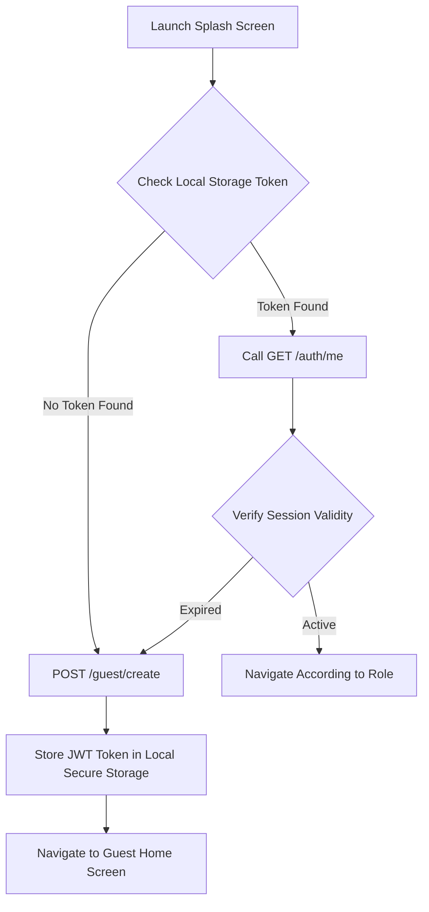
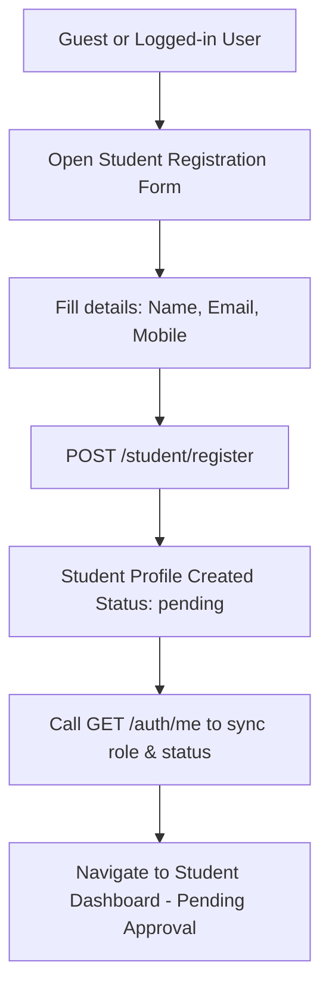

# FinTrade LMS — Mobile Application User-Student Flow Document

This document outlines the authentication, guest management, and student registration flows specifically for the **FinTrade Mobile Application**. 

> [!IMPORTANT]  
> This documentation and these flows are **strictly dedicated to the Mobile Application**. 
> Do not modify or apply these to any MWeb (Mobile Web / Main Web) APIs, flows, business logic, or documentation. Existing MWeb functionality must remain completely unchanged.

---

## Table of Contents
1. [Guest Creation Flow](#1-guest-creation-flow)
2. [Auth Me Flow & Navigation Logic](#2-auth-me-flow--navigation-logic)
3. [Student Registration Flow](#3-student-registration-flow)
4. [Token Management & Best Practices](#4-token-management--best-practices)

---

## 1. Guest Creation Flow

When the mobile application is opened for the first time, a guest session must be initialized to track the device and allow the guest to browse public home screens.

### Flow Diagram



### Guest Creation API

#### `POST /guest/create`

Initialize a guest session for a specific device.

* **Headers:**
  * `Content-Type: application/json`

* **Request Body:**
  ```json
  {
    "deviceId": "9b1deb4d-3b7d-4bad-9bdd-2b0d7b3dcb6d",
    "platform": "ios"
  }
  ```

* **Parameters Schema:**
  | Field | Type | Allowed Values | Description |
  |---|---|---|---|
  | `deviceId` | string | *Any unique identifier* | Hardware UUID or vendor ID of the mobile device. |
  | `platform` | string | `android` \| `ios` | The operating system of the device. |

* **Response `200 OK` / `201 Created`:**
  ```json
  {
    "success": true,
    "token": "eyJhbGciOiJIUzI1NiIsInR5cCI6IkpXVCJ9.eyJzdWIiOiJnMTIzNCIsImV4cCI6MTc4MjMxMDgwMH0...",
    "user": {
      "id": "guest_890a218f",
      "role": "guest"
    }
  }
  ```

---

## 2. Auth Me Flow & Navigation Logic

The `GET /auth/me` endpoint retrieves the current session details. It must be called in the following scenarios to ensure correct application routing and synchronized local state:
1. **On App Launch** (if a token is already present in secure storage).
2. **Immediately After Login** (via email/password or OTP).
3. **Immediately After Registration**.
4. **Immediately After Student Registration** (to transition role/status).
5. **After Token Refresh**.

### Auth Me API

#### `GET /auth/me`

Retrieve authenticated user profile and student application status.

* **Headers:**
  * `Authorization: Bearer <jwt_token>`
  * `Accept: application/json`

* **Response `200 OK`:**
  ```json
  {
    "success": true,
    "user": {
      "id": "100234",
      "name": "Alex Mercer",
      "email": "alex.mercer@example.com",
      "role": "guest",
      "studentStatus": null
    }
  }
  ```

### Navigation & Routing Logic

Based on the `role` returned from `GET /auth/me`, the application must route the user to their designated entry point:

```text
[GET /auth/me Response]
        ↓
    Get "role"
        ↓
   ├── role == "guest"    → Navigate to Guest Home
   ├── role == "user"     → Navigate to User Dashboard
   ├── role == "student"  → Navigate to Student Dashboard (Refer to Status Flow)
   ├── role == "faculty"  → Navigate to Faculty Dashboard
   └── role == "admin"    → Navigate to Admin Dashboard
```

---

## 3. Student Registration Flow

Student registration is an onboarding pipeline that turns a generic **Guest** or **User** account into an active **Student** account.

### Flow Diagram



### Student Registration API

#### `POST /student/register`

Register a student profile. If the current session is a guest session, the backend links the new student profile to this identity.

* **Headers:**
  * `Authorization: Bearer <jwt_token>`
  * `Content-Type: application/json`

* **Request Body:**
  ```json
  {
    "firstName": "Alex",
    "lastName": "Mercer",
    "email": "alex.mercer@example.com",
    "mobile": "+919876543210"
  }
  ```

* **Parameters Schema:**
  | Field | Type | Required | Description |
  |---|---|---|---|
  | `firstName` | string | Yes | First name of the student. |
  | `lastName` | string | Yes | Last name/Surname of the student. |
  | `email` | string | Yes | Contact email address. |
  | `mobile` | string | Yes | Mobile number with country code. |

* **Response `201 Created`:**
  ```json
  {
    "success": true,
    "studentId": "std_89210a7f",
    "studentStatus": "pending"
  }
  ```

### Student Status Lifecycle

Upon becoming a student, the user moves through different statuses based on their entrance exams, KYC checks, and administrator review. The application dashboard should update its UI states accordingly:

| Status Value | Meaning | Expected Mobile UI State / Next Steps |
|---|---|---|
| `pending` | Account created; waiting for initial screening. | Show onboarding welcome screen with application status. |
| `exam_pending` | Registered but has not completed the entrance exam. | Prompt the user to start the entrance exam immediately. |
| `exam_passed` | Passed the entrance exam; awaiting documentation. | Show a banner prompting the user to submit KYC files. |
| `kyc_pending` | KYC files uploaded; waiting for review. | Display "Documents under review" status message. |
| `verified` | Fully approved student. | Enable the main Student Dashboard, Course Materials, and Live Classes. |
| `rejected` | Application was declined. | Display the rejection notice and support options. |

### Auth Me Response Example After Student Registration

After successfully executing the registration, calling `GET /auth/me` will return an updated role and status:

```json
{
  "success": true,
  "user": {
    "id": "100234",
    "name": "Alex Mercer",
    "email": "alex.mercer@example.com",
    "role": "student",
    "studentStatus": "pending"
  }
}
```

---

## 4. Token Management & Best Practices

1. **Persistence:** Store the JWT token securely using **Keychain** (iOS) or **EncryptedSharedPreferences** (Android).
2. **Expiration Handling:** If `GET /auth/me` returns a `401 Unauthorized` or token expired error, attempt to refresh the token. If that fails, clear local storage and run the [Guest Creation Flow](#1-guest-creation-flow) to obtain a fresh guest token.
3. **Logout:** Upon logging out, do not leave the app in a tokenless state. Instead, trigger the `POST /guest/create` endpoint to assign a new guest token so the user can continue to view public content.
